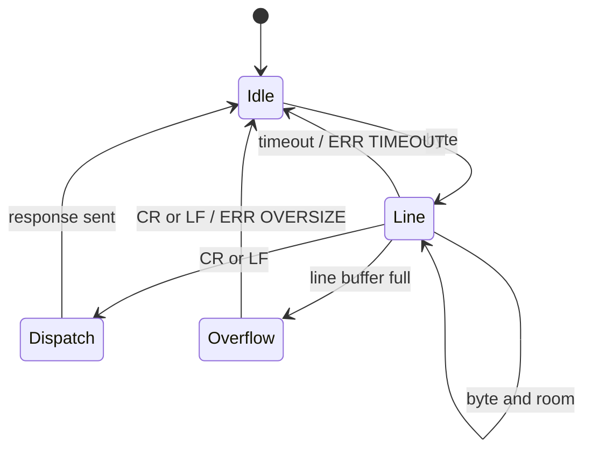

# Design

## Control Architecture

DSPi exposes one logical control surface with multiple transports.

- USB remains the compatibility transport.  It keeps the existing vendor request IDs, `wValue` packing, and binary payloads.
- UART is an optional build-time transport for a trusted local control MCU.  It wraps the same request IDs and payload bytes in line-oriented ASCII.
- `dspi_control_in()`, `dspi_control_out()`, `dspi_control_bulk_get()`, and `dspi_control_bulk_set()` are the shared command boundary.  They own request dispatch, range checks, live-state mutation, deferred operation scheduling, and compact binary response generation.
- Deferred flash and disruptive pipeline work still run from the main loop.  Transports only set pending flags or copy bounded payloads into existing buffers.
- USB and UART are both allowed to issue commands.  State is not duplicated, so last successful writer wins naturally.

## UART Protocol

The UART protocol is intentionally close to the USB vendor table:

- `PING` returns `OK PONG`.
- `G <request> [wValue] [wLength]` runs an IN/action request and returns `OK <hex-response>`.
- `S <request> [wValue] <hex-payload>` runs an OUT request and returns `OK` or `OK ACCEPTED`.
- `BGET` returns the complete `WireBulkParams` payload as hex.
- `BSET <hex-WireBulkParams>` accepts a complete bulk payload and defers application to the main loop.

Responses are one line: `OK`, `OK <payload-or-note>`, or `ERR <code>`.

Parser state machine:

UART is disabled by default to preserve existing hardware pin use.  Board builds enable it with `DSPi_UART_CONTROL_ENABLE=1` and set the UART instance, pins, baud rate, optional flow-control pins, line length, and parser timeout in CMake definitions.
