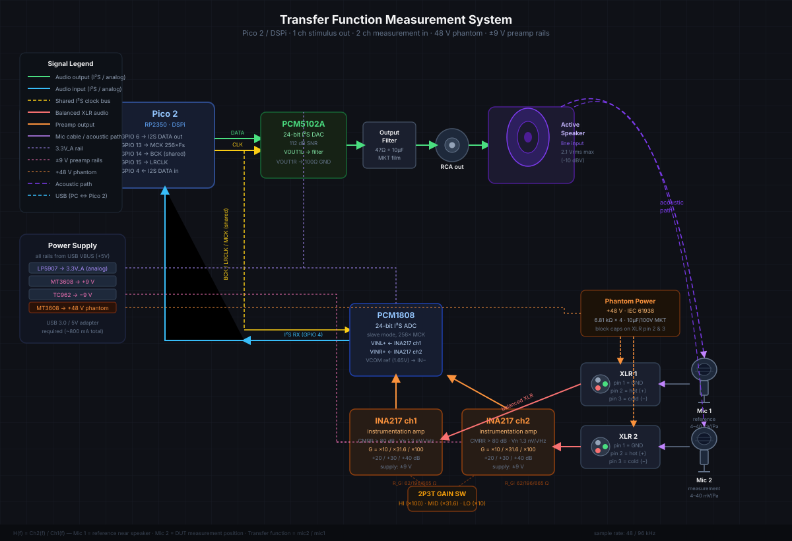

# Acoustic Transfer Function Measurement System

> **Pico 2 / DSPi** — 1-channel stimulus output · 2-channel measurement input · 48 V phantom power · ±9 V preamp rails · 48 / 96 kHz

---

## Table of Contents

1. [Project Overview](#1-project-overview)
2. [Use Cases](#2-use-cases)
3. [System Architecture](#3-system-architecture)
4. [Bill of Materials (BOM)](#4-bill-of-materials-bom)
5. [Hardware Setup & Wiring](#5-hardware-setup--wiring)
6. [DSPi Configuration](#6-dspi-configuration)
7. [Measurement Procedure](#7-measurement-procedure)
8. [Performance Specifications](#8-performance-specifications)
9. [References](#9-references)

---

## 1. Project Overview

This project turns a **Raspberry Pi Pico 2** running the **DSPi firmware** into a two-channel acoustic transfer-function measurement instrument. A known test signal (e.g. swept sine, white/pink noise, MLS) is played back through a DAC and an active loudspeaker while two measurement microphones capture the acoustic response simultaneously. The transfer function is then computed on the host PC.

**Transfer function definition:**

```
H(f) = Ch2(f) / Ch1(f)
```

where:

- **Ch1 (Mic 1)** = reference microphone, placed close to the loudspeaker (direct-field reference)
- **Ch2 (Mic 2)** = measurement microphone at the target position (DUT / listening position)

Dividing in the frequency domain cancels the loudspeaker's own response and any room-common effects, yielding the true acoustic path from reference to measurement point.

---

## 2. Use Cases

| Application | Description |
|---|---|
| **Loudspeaker frequency response** | Measure the on- or off-axis response of a driver or cabinet relative to a calibrated reference mic |
| **Room acoustics / RT60** | Capture the impulse response of a room; derive reverb time, clarity, and strength metrics |
| **Room correction DSP tuning** | Feed the measured H(f) into EQ or FIR filter design tools (REW, rePhase, Acourate) |
| **Diffuse-field / binaural HRTFs** | Two-point measurement for head-related transfer functions |
| **Subwoofer / crossover alignment** | Phase-coherent multi-mic measurements for time-alignment of crossover networks |
| **Automotive acoustics** | In-car placement optimisation; seat-to-seat transfer paths |

---

## 3. System Architecture

```
PC (REW / host)
    │ USB
    ▼
Pico 2 (DSPi firmware, RP2350)
    │ GPIO 6  → I²S DATA out ──→ PCM5102A DAC ──→ 47Ω+10µF filter ──→ RCA ──→ Active Speaker
    │ GPIO 13 → MCK 256×Fs ──┐                                                       │
    │ GPIO 14 → BCK ─────────┤ (shared clock bus)                              acoustic path
    │ GPIO 15 → LRCLK ───────┤                                                       │
    │                         └────────────────────→ PCM1808 ADC (slave)          Mic 1 (ref)
    │ GPIO 4  ← I²S DATA in ←── PCM1808 ADC ←── INA217 ×2 ←── XLR 1 ←──────────┘
    │                                                            INA217 ch2 ← XLR 2 ← Mic 2 (meas.)
    └─────────────────────────────────────────────────────────────────────────────────────────────
```

See also the full system diagram:



For the I²S wiring detail between Pico 2 and PCM1808:


---

## 4. Bill of Materials (BOM)

### 4.1 Core Digital / ICs

| Qty | Part | Description | Key Specs |
|-----|------|-------------|-----------|
| 1 | **Raspberry Pi Pico 2** | Microcontroller board, RP2350 | USB, 48 GPIO, PIO I²S |
| 1 | **PCM5102A** | Stereo I²S DAC | 24-bit, 112 dB SNR, 2.1 Vrms out |
| 1 | **PCM1808** | Stereo I²S ADC | 24-bit, slave mode, 256× MCK |
| 2 | **INA217** | Instrumentation amplifier | CMRR > 80 dB, Vn = 1.3 nV/√Hz, ±9 V supply |

### 4.2 Gain Setting Resistors (INA217 R_G, 0.1 % metal film)

| Gain | Multiplier | R_G |
|------|-----------|-----|
| +20 dB | ×10 | 665 Ω |
| +30 dB | ×31.6 | 196 Ω |
| +40 dB | ×100 | 61.9 Ω |

### 4.3 Gain Switch

| Qty | Part | Description |
|-----|------|-------------|
| 1 | **2P3T rotary switch** | Ganged, couples both INA217 R_G simultaneously; positions: HI (×100) / MID (×31.6) / LO (×10) |

### 4.4 DAC Output Filter

| Qty | Value | Type | Purpose |
|-----|-------|------|---------|
| 1 | 47 Ω | Metal film resistor | Output series resistor |
| 1 | 10 µF | MKT film capacitor | DC-blocking / RF filter |

### 4.5 Connectors

| Qty | Part | Description |
|-----|------|-------------|
| 1 | RCA (female) | Line output to active speaker |
| 2 | **XLR-3F** (female) | Balanced mic inputs, IEC 61938 phantom power |

### 4.6 Phantom Power Section

| Qty | Part | Value / Spec | Notes |
|-----|------|--------------|-------|
| 4 | Resistor, 1 % | 6.81 kΩ | IEC 61938 phantom feed, 2 per channel (pin 2 & 3) |
| 2 | Capacitor | 10 µF / 100 V, MKT | DC-block on XLR pin 2 & 3 |
| 1 | Polyfuse | 50 mA hold | Phantom rail overcurrent protection |

### 4.7 Power Supply

| Qty | Part | Function | Output |
|-----|------|----------|--------|
| 1 | **LP5907** | LDO regulator | 3.3 V_A (analog supply for DAC/ADC) |
| 2 | **MT3608** | Boost converter | +9 V (preamp) and +48 V (phantom) |
| 1 | **TC962** | Charge pump | −9 V (from +9 V input) |

All rails derived from USB VBUS (+5 V). Requires USB 3.0 port or 5 V / ≥1 A adapter (~800 mA total).

### 4.8 Microphones (not included, user-supplied)

| Sensitivity | Typical application |
|-------------|---------------------|
| 40 mV/Pa | Low-noise reference mic (higher sensitivity) |
| 4 mV/Pa | Higher SPL applications; use with +30 / +40 dB gain |

Both types require 48 V phantom power.

---

## 5. Hardware Setup & Wiring

### 5.1 GPIO Pin Assignment

| GPIO | Direction | Signal | Connected To |
|------|-----------|--------|-------------|
| 4 | IN | I²S DATA RX | PCM1808 DOUT |
| 6 | OUT | I²S DATA TX (Slot 0) | PCM5102A DIN |
| 13 | OUT | MCK 256×Fs | PCM5102A SCK, PCM1808 SCKI |
| 14 | OUT | BCK (shared) | PCM5102A BCK, PCM1808 BCK |
| 15 | OUT | LRCLK (shared) | PCM5102A LRCK, PCM1808 LRCK |

> **Note:** BCK, LRCLK, and MCK are shared between DAC and ADC. The Pico 2 is clock master; the PCM1808 operates in slave mode.

### 5.2 DAC Output Chain (Stimulus)

```
Pico 2 GPIO 6
  └─ I²S DATA ──→ PCM5102A DIN
                        │
                    VOUT1L ──→ 47 Ω ──→ 10 µF (MKT) ──→ RCA out ──→ Active Speaker (line in)
                    VOUT1R ──→ 100 Ω ──→ GND  (right channel terminated)
```

Maximum output: **2.1 Vrms** (PCM5102A full scale, ≈ +6.4 dBV / +8.7 dBu).

### 5.3 Microphone Input Chain (2 channels)

```
Condenser Mic (48 V phantom)
  └─ XLR-3F (pin 1 = GND, pin 2 = hot, pin 3 = cold)
       │  +48 V phantom via 6.81 kΩ (pin 2 & 3) + 10 µF DC-block
       ▼
  INA217 (balanced in, G = +20/+30/+40 dB via 2P3T switch)
       │  ±9 V supply
       ▼
  PCM1808 VINL+ / VINR+  (VCOM 1.65 V → differential IN−)
       │
       ▼
  PCM1808 DOUT ──→ Pico 2 GPIO 4 (I²S RX)
```

### 5.4 Gain Switch Positions

| Switch Position | R_G (each channel) | Gain |
|---|---|---|
| LO | 665 Ω | +20 dB (×10) — use with 40 mV/Pa mic, quiet environments |
| MID | 196 Ω | +30 dB (×31.6) — general purpose |
| HI | 61.9 Ω | +40 dB (×100) — use with 4 mV/Pa mic or low-SPL sources |

The switch is a **ganged 2P3T** (double-pole) rotary so both INA217 channels track together.

### 5.5 Power Supply Wiring

| Rail | Source | Load |
|------|--------|------|
| +5 V (VBUS) | USB | All regulators |
| 3.3 V_A | LP5907 (from +5 V) | PCM5102A AVDD, PCM1808 AVDD |
| +9 V | MT3608 (from +5 V) | INA217 V+, TC962 input |
| −9 V | TC962 (from +9 V) | INA217 V− |
| +48 V | MT3608 (from +5 V) | Phantom power via 6.81 kΩ + polyfuse |

---

## 6. DSPi Configuration

Configure the following parameters in the DSPi firmware (via WebUSB or control interface):

```
INPUT_SOURCE      = I2S (value 2)
MCK_ENABLE        = true
MCK_MULTIPLIER    = 256
OUTPUT_SLOT_0     = I2S
SAMPLE_RATE       = 48000   # or 96000 for extended bandwidth
```

### 6.1 Sample Rate Selection

| Sample Rate | Usable Bandwidth | Notes |
|-------------|-----------------|-------|
| 48 kHz | DC – 20 kHz | Sufficient for full audio range; lower USB bandwidth |
| 96 kHz | DC – 40 kHz | Extended range for ultrasonic / tweeter measurements |

### 6.2 I²S Slave Mode (PCM1808)

The PCM1808 operates in **slave mode**, deriving BCK, LRCLK, and MCK from the Pico 2. Ensure the `256× MCK` pin (GPIO 13) is active before the ADC is powered; the PCM1808 requires MCK for its internal PLL to lock.

---

## 7. Measurement Procedure

### 7.1 Preparation

1. Connect Mic 1 (reference) close to the loudspeaker membrane (near-field, ~10–30 cm) via XLR 1.
2. Connect Mic 2 (measurement) at the target listening position or on the DUT under test via XLR 2.
3. Set gain switch: start with **MID (+30 dB)** and adjust based on signal level (target −10 to −6 dBFS).
4. Connect the RCA output to the active speaker's line input.
5. Power the device via USB 3.0 port or a dedicated 5 V / 1 A adapter.

### 7.2 DSPi Setup on Host

1. Open **REW (Room EQ Wizard)** or equivalent measurement software on the PC.
2. Set the audio interface to the Pico 2 / DSPi USB audio device.
3. Assign **Output Ch 1** → DAC stimulus.
4. Assign **Input Ch 1** → Mic 1 (reference), **Input Ch 2** → Mic 2 (measurement).
5. Select sample rate (48 kHz or 96 kHz) — must match DSPi configuration.

### 7.3 Stimulus Signal

| Stimulus | Recommended Use |
|----------|-----------------|
| **Log-swept sine** (chirp) | Best SNR; recommended for IR / transfer function |
| **MLS (Maximum Length Sequence)** | Fast; good for real-time monitoring |
| **Pink noise** | Visual level check; use with RTA |
| **White noise** | Extended high-frequency check |

Set stimulus level to −12 dBFS initially; increase carefully to avoid ADC clipping (watch for > −3 dBFS peaks).

### 7.4 Transfer Function Calculation

In REW or your software, compute:

```
H(f) = FFT(Ch2) / FFT(Ch1)
```

This operation cancels:
- The loudspeaker's frequency response
- The stimulus signal's spectrum
- Any common-mode interference on both mics

The result is the **acoustic transfer function** between the reference and measurement positions.

### 7.5 Level Optimisation

| Symptom | Action |
|---------|--------|
| Signal too low (< −30 dBFS) | Increase gain switch one step up |
| Clipping (> −1 dBFS) | Reduce gain switch one step down or lower stimulus level |
| High noise floor | Check phantom power LED / voltage; verify microphone connections; ensure USB 3.0 power |
| Hum / 50 Hz interference | Check ground loops; use XLR balanced cables; keep power cables away from mic cables |

---

## 8. Performance Specifications

| Parameter | Value | Conditions |
|-----------|-------|------------|
| ADC resolution | 24 bit | PCM1808 |
| DAC resolution | 24 bit | PCM5102A |
| DAC SNR | 112 dB | A-weighted |
| Preamp gain (selectable) | +20 / +30 / +40 dB | INA217, 0.1 % R_G |
| Preamp CMRR | > 80 dB | INA217 |
| Preamp voltage noise | 1.3 nV/√Hz | INA217, input-referred |
| Phantom voltage | +48 V | IEC 61938 |
| Phantom feed resistance | 6.81 kΩ per pin | IEC 61938 compliant |
| Phantom overcurrent protection | 50 mA polyfuse | |
| Preamp supply | ±9 V | MT3608 + TC962 |
| Analog supply | 3.3 V (LDO) | LP5907, low-noise |
| Max DAC output | 2.1 Vrms | −10 dBV line level |
| Sample rates | 48 kHz, 96 kHz | |
| Usable bandwidth | DC – 20 kHz / 40 kHz | 48 / 96 kHz mode |
| Number of mic inputs | 2 (balanced XLR) | |
| Number of stimulus outputs | 1 (unbalanced RCA) | |
| USB power requirement | ~800 mA @ +5 V | USB 3.0 or adapter |

---

## 9. References

- **System wiring diagram:** [`Images/transfer-function-setup.svg`](../../../Images/transfer-function-setup.svg)
- **PCM1808 / Pico 2 I²S wiring:** [`Images/pcm1808_pico2_i2s_wiring.svg`](../../../Images/pcm1808_pico2_i2s_wiring.svg)
- **DSPi I²S input specification:** [`Documentation/Features/i2s_input_spec.md`](../../Features/i2s_input_spec.md)
- **DSPi I²S slave input:** [`Documentation/Features/i2s_slave_input_spec.md`](../../Features/i2s_slave_input_spec.md)
- **DSPi master clock specification:** [`Documentation/Features/master_clock_spec.md`](../../Features/master_clock_spec.md)
- [PCM5102A Datasheet (Texas Instruments)](https://www.ti.com/product/PCM5102A)
- [PCM1808 Datasheet (Texas Instruments)](https://www.ti.com/product/PCM1808)
- [INA217 Datasheet (Texas Instruments)](https://www.ti.com/product/INA217)
- [IEC 61938: Phantom Powering Standard](https://www.iec.ch/publication/6095)
- [REW – Room EQ Wizard](https://www.roomeqwizard.com/)
