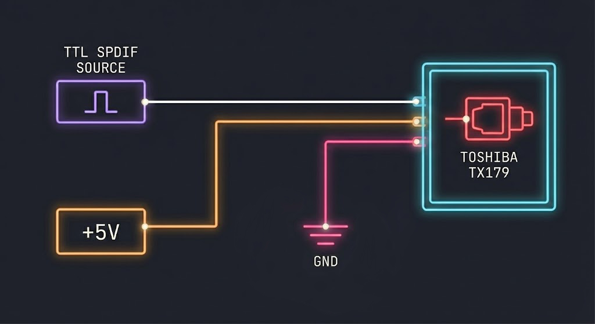
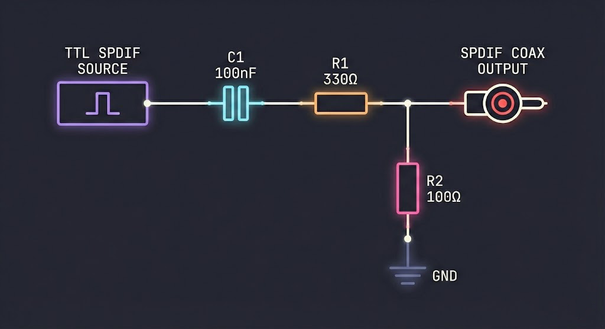

# DSPi Firmware

**DSPi** transforms a Raspberry Pi Pico or other RP2040-based board into a very competent and inexpensive little digital audio processor. It acts as a USB sound card with an onboard DSP engine, allowing you to make use of essential tools like room correction, active crossovers, parametric EQ, and time alignment.

It is my hope that the RP2040 and RP2350 will garner a reputation as the "swiss army knife of audio for less than a cup of coffee".

---

## Key Capabilities

*   **USB Audio Interface:** Plug-and-play under macOS, Windows, Linux, and iOS.
*   **Parametric Equalization:** Ten PEQ filters per master audio channel (Left/Right) and two filters per output channel (Left/Right/Sub).
*   **Time Alignment:** Delay individual channels (up to 170ms) to ensure alignment between subwoofer and main speakers.
*   **SPDIF Output:** Digital SPDIF output enables the use of any standard DAC.
*   **Subwoofer Output:** Dedicated mono output channel that enables direct subwoofer output without the need for a second DAC.

---

## Audio Signal Flow

DSPi processes audio in a linear, low latency pipeline.

1.  **Input (USB):** Audio from your PC or mobile device.
2.  **Preamp & Master EQ:** The signal is volume-adjusted and passed through 20 bands of PEQ (10 per channel).
3.  **Crossover Split:**
    *   **Main Channels:** Routed to the digital output after PEQ, becoming Main Outs.
    *   **Subwoofer Channel:** Created by summing left and right main channels, after PEQ.
4.  **Output Tuning:**
    *   **Main Outs:** 2 bands of PEQ per channel (ideal for 12dB/oct or 24dB/oct high pass filter).
    *   **Sub Out:** 2 bands of PEQ (ideal for 12dB/oct or 24dB/oct low pass filter)
5.  **Time Alignment:** Delays are applied to each channel, if configured.
6.  **Hardware Output:**
    *   **S/PDIF (Digital):** Connects to your DAC or Receiver.
    *   **PDM (Analog):** Connects to an active subwoofer's analog input.

---

## Hardware Setup

### Flashing the Firmware
1.  Download the latest `dspi.uf2` release.
2.  Hold the **BOOTSEL** button on your Pico while plugging it into your computer.
3.  A drive named `RPI-RP2` will appear.
4.  Drag and drop the `dspi.uf2` file onto this drive.
5.  The Pico will reboot and appear as a "Weeb Labs DSPi' audio device.
6.  Download and launch the DSPi Console application to control the DSPi.

### Wiring Guide

Connecting DSPi to your audio hardware is straightforward.

| Function | Pin | Connection |
| :--- | :--- | :--- |
| **Digital Audio Out** (S/PDIF) | `GPIO 20` | Connects to the input of a DAC or Receiver. |
| **Subwoofer Out** (PDM) | `GPIO 10` | Connects to an active subwoofer. |
| **USB** | `Micro-USB` | Connects to your Host device (PC/Mac/Mobile Device). |

> **Note:** S/PDIF output requires either a Toshiba TX179 optical transmitter or a simple resistor divider . PDM output is a 1-bit logic signal that requires a resistor and capacitor to turn into analog audio.

  

### Subwoofer PDM Specifications
The subwoofer output uses a high-performance software-defined Sigma-Delta modulator running on Core 1.

*   **Modulation:** 2nd-Order Sigma-Delta
*   **Oversampling Ratio:** 256x (12.288 MHz bit clock)
*   **Dither:** TPDF (Triangular Probability Density Function)
*   **DC Protection:** Leaky integrator design preventing DC offset accumulation.

---

## Developer Reference

The following section details the internal architecture for developers wishing to modify the firmware or write custom control software.

### System Architecture
*   **Core 0:** Handles USB communication (TinyUSB), audio streaming, and control logic.
*   **Core 1:** Dedicated to the Sigma-Delta modulator (PDM generation) and buffer management.
*   **PIO & DMA:** Hardware offloading for S/PDIF encoding and bitstream generation ensures zero CPU overhead for I/O.
*   **Math Engine:** 32-bit fixed-point (`int32_t`) processing pipeline running natively at 48kHz.

### USB Control Protocol
Configuration is performed via **Interface 2** (Vendor Interface) using Control Transfers.

**Request Table (Hex Codes)**

| ID | Name | Payload | Description |
| :--- | :--- | :--- | :--- |
| `0x42` | `REQ_SET_EQ_PARAM` | 16 bytes | Upload filter parameters. |
| `0x43` | `REQ_GET_EQ_PARAM` | 4 bytes | Read back filter parameters. |
| `0x44` | `REQ_SET_PREAMP` | 4 bytes | Set global gain (float dB). |
| `0x46` | `REQ_SET_BYPASS` | 1 byte | Bypass Master EQ (1=On, 0=Off). |
| `0x48` | `REQ_SET_DELAY` | 4 bytes | Set channel delay (float ms). |
| `0x50` | `REQ_GET_STATUS` | 12 bytes | Get live meter levels and CPU load. |
| `0x51` | `REQ_SAVE_PARAMS` | 1 byte | Save settings to Flash. |
| `0x53` | `REQ_FACTORY_RESET` | 1 byte | Reset RAM to defaults. |

*(Full list of requests available in `config.h`)*

### Data Structures

**Filter Packet (16 bytes):**
```c
struct __attribute__((packed)) {
    uint8_t channel;  // 0-4
    uint8_t band;     // 0-9
    uint8_t type;     // 0=Flat, 1=Peak, 2=LS, 3=HS, 4=LP, 5=HP
    uint8_t reserved;
    float freq;       // Hz
    float Q;
    float gain_db;
}
```

---


### Building from Source
If you wish to modify the code:

```bash
mkdir build
cd build
cmake ..
make
```
