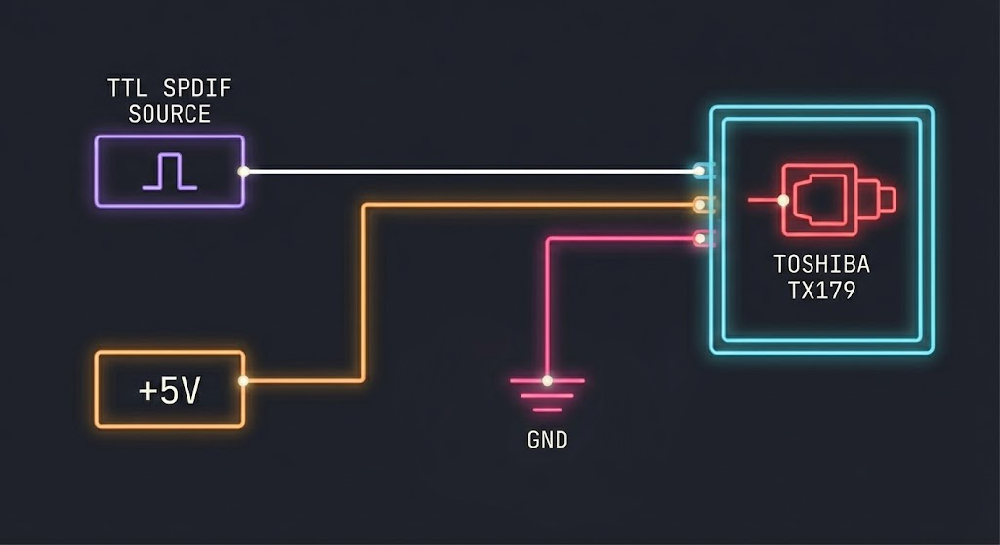
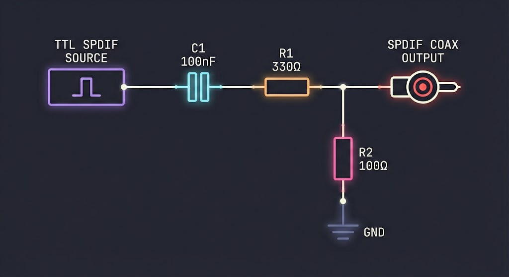

# DSPi Firmware

**DSPi** transforms a Raspberry Pi Pico or other RP2040-based board into a very competent and inexpensive little digital audio processor. It acts as a USB sound card with an onboard DSP engine, allowing you to make use of essential tools like room correction, active crossovers, parametric EQ, time alignment, loudness compensation, and headphone crossfeed.

It is my hope that the RP2040 and RP2350 will garner a reputation as the "swiss army knife of audio for less than a cup of coffee".

---

## Table of Contents

- [Key Capabilities](#key-capabilities)
- [Platform Support](#platform-support)
- [Audio Signal Chain](#audio-signal-chain)
- [Hardware Setup](#hardware-setup)
- [DSP Features](#dsp-features)
  - [Matrix Mixer](#matrix-mixer)
  - [Parametric Equalization](#parametric-equalization)
  - [Loudness Compensation](#loudness-compensation)
  - [Headphone Crossfeed](#headphone-crossfeed)
  - [Subwoofer PDM Output](#subwoofer-pdm-output)
- [Developer Reference](#developer-reference)
  - [System Architecture](#system-architecture)
  - [Performance Tuning](#performance-tuning)
  - [USB Control Protocol](#usb-control-protocol)
  - [System Telemetry](#reqgetstatus-0x50---system-telemetry)
  - [Data Structures](#data-structures)
- [Building from Source](#building-from-source)
- [License](#license)

---

## Key Capabilities

*   **USB Audio Interface:** Plug-and-play under macOS, Windows, Linux, and iOS.
*   **4 S/PDIF Outputs:** Four independent stereo S/PDIF outputs (8 channels) for multi-way active speaker systems, enabling use of any standard DAC.
*   **2x9 Matrix Mixer:** Route either or both USB input channels to any of the 9 outputs with independent gain and phase invert per crosspoint.
*   **Parametric Equalization:** Up to 10 PEQ bands per channel (2 master + 9 output = 11 channels), with 6 filter types. Up to 110 total filter bands on RP2350.
*   **Loudness Compensation:** Volume-dependent EQ based on the ISO 226:2003 equal-loudness contour standard. Automatically boosts bass and treble at low listening levels to maintain perceived tonal balance.
*   **Headphone Crossfeed:** BS2B-based crossfeed with interaural time delay (ITD) reduces unnatural stereo separation for headphone listening. Three classic presets plus fully custom parameters.
*   **Per-Output Gain & Mute:** Independent gain and mute controls for each of the 9 output channels.
*   **Time Alignment:** Per-output delay (up to 170ms on RP2350, 85ms on RP2040) for speaker/subwoofer alignment with automatic latency compensation between S/PDIF and PDM output paths.
*   **Subwoofer Output:** Dedicated mono PDM output channel with a high-performance 2nd-order delta-sigma modulator, enabling direct subwoofer output without the need for a second DAC.
*   **Dual-Core DSP (RP2350):** EQ processing is split across both cores for maximum throughput when multiple outputs are active.
*   **Configurable Output Pins:** All output GPIO pins can be reassigned at runtime to suit custom PCB layouts, no reflashing required.
*   **Flash Persistence:** All settings — including pin assignments — are saved to flash and restored automatically at boot.

---

## Platform Support

| Feature | RP2040 (Pico) | RP2350 (Pico 2) |
|---------|---------------|-----------------|
| **Clock Speed** | 288 MHz (OC) | 288 MHz |
| **Audio Processing** | Q28 Fixed-Point | Mixed-Precision Float/Double |
| **Master EQ Bands** | 10 per channel (20 total) | 10 per channel (20 total) |
| **Output EQ Bands** | 2 per channel (18 total) | 10 per channel (90 total) |
| **Total Filter Bands** | 38 | 110 |
| **S/PDIF Outputs** | 4 stereo pairs (8 channels) | 4 stereo pairs (8 channels) |
| **PDM Output** | 1 (subwoofer) | 1 (subwoofer) |
| **Max Delay** | 85ms per output | 170ms per output |
| **Math Engine** | Hand-optimized ARM Assembly | Hardware FPU + DCP Coprocessor |
| **Dual-Core EQ** | No | Yes (Core 1 processes outputs 3-8) |
| **Status** | Production | Production |

Both platforms are fully tested and production-ready. The RP2350 offers significantly more processing headroom thanks to its hardware floating-point unit and Double-precision Coprocessor (DCP), enabling more filter bands, longer delays, and dual-core EQ processing.

---

## Audio Signal Chain

DSPi processes audio in a linear, low-latency pipeline:

```
USB Input (16-bit PCM Stereo)
    |
Preamp (global gain adjustment)
    |
Loudness Compensation (volume-dependent EQ, optional)
    |
Master EQ (10 bands per channel, Left/Right)
    |
Headphone Crossfeed (BS2B + ITD, optional)
    |
Matrix Mixer (2 inputs x 9 outputs, per-crosspoint gain & phase)
    |
    +-- Out 1-2 --> Output EQ --> Gain/Mute --> Delay --> S/PDIF 1 (GPIO 6)
    +-- Out 3-4 --> Output EQ --> Gain/Mute --> Delay --> S/PDIF 2 (GPIO 7)
    +-- Out 5-6 --> Output EQ --> Gain/Mute --> Delay --> S/PDIF 3 (GPIO 8)
    +-- Out 7-8 --> Output EQ --> Gain/Mute --> Delay --> S/PDIF 4 (GPIO 9)
    +-- Out 9   --> Output EQ --> Gain/Mute --> Delay --> PDM Sub  (GPIO 10)
```

### Signal Chain Details

1.  **Input (USB):** 16-bit PCM stereo audio from your host device.
2.  **Preamp:** Global gain adjustment applied to both channels.
3.  **Loudness Compensation:** Optional ISO 226:2003 equal-loudness EQ that adapts to the current volume level. At low volumes, bass and treble are boosted to compensate for the ear's reduced sensitivity. Configurable reference SPL and intensity.
4.  **Master EQ:** Up to 10 bands of parametric EQ per channel (Left/Right). Supports peaking, low shelf, high shelf, low pass, and high pass filter types.
5.  **Headphone Crossfeed:** Optional BS2B crossfeed that mixes a filtered, delayed portion of each channel into the opposite channel. Uses a complementary filter design with interaural time delay (ITD) via an all-pass filter. Three presets (Default, Chu Moy, Jan Meier) plus custom frequency and feed level. ITD can be independently toggled.
6.  **Matrix Mixer:** A 2x9 routing matrix maps the two USB input channels (Left/Right) to 9 output channels. Each crosspoint has independent enable, gain (-inf to +12dB), and phase invert. Outputs can be individually enabled/disabled to save CPU. Typical configurations include stereo (L→Out1, R→Out2), mono sub (L+R→Out9), and multi-way active crossovers.
7.  **Output EQ:** Independent EQ per output channel (up to 10 bands on RP2350, 2 on RP2040). Ideal for crossover filters and per-driver correction.
8.  **Per-Output Gain & Mute:** Independent gain (-inf to +12dB) and mute for each of the 9 output channels.
9.  **Master Volume:** USB audio class volume control (-91 to 0 dB).
10. **Time Alignment:** Per-output delay for speaker alignment. RP2350 supports up to 170ms (8192 samples at 48kHz), RP2040 supports up to 85ms (4096 samples). Automatic latency compensation between S/PDIF and PDM output paths.
11. **Outputs:** Four S/PDIF stereo digital outputs (8 channels) on GPIO 6-9, plus one PDM mono output (subwoofer) on GPIO 10.

---

## Hardware Setup

### Flashing the Firmware
1.  Download the latest `DSPi.uf2` release for your board.
2.  Hold the **BOOTSEL** button on your Pico while plugging it into your computer.
3.  A drive named `RPI-RP2` will appear.
4.  Drag and drop the `.uf2` file onto this drive.
5.  The Pico will reboot and appear as a "Weeb Labs DSPi" audio device.
6.  Download and launch the DSPi Console application to control the DSPi.

### Wiring Guide

| Function | Pin | Connection |
| :--- | :--- | :--- |
| **S/PDIF Output 1** (Out 1-2) | `GPIO 6` (default) | DAC or receiver for main L/R or multi-way pair 1 |
| **S/PDIF Output 2** (Out 3-4) | `GPIO 7` (default) | DAC or receiver for multi-way pair 2 |
| **S/PDIF Output 3** (Out 5-6) | `GPIO 8` (default) | DAC or receiver for multi-way pair 3 |
| **S/PDIF Output 4** (Out 7-8) | `GPIO 9` (default) | DAC or receiver for multi-way pair 4 |
| **Subwoofer Out** (PDM, Out 9) | `GPIO 10` (default) | Active subwoofer or PDM-to-analog filter |
| **USB** | `Micro-USB` | Host device (PC/Mac/Mobile Device) |

> **Note:** S/PDIF output requires either a Toshiba TX179 optical transmitter or a simple resistor divider. PDM output is a 1-bit logic signal that requires a resistor and capacitor to form a low-pass filter for conversion to analog audio.

### Custom Pin Assignments

The default pin assignments above work out of the box, but all five output pins can be reassigned at runtime through the DSPi Console application — no reflashing required. This is useful when designing custom PCBs or adapting to boards where the default GPIOs are inconvenient.

Pin assignments are saved to flash and restored automatically at boot. A few GPIOs are reserved and unavailable for output use: GPIO 12 (UART TX) and GPIOs 23-25 (power control and LED).

  

---

## DSP Features

### Matrix Mixer

A 2x9 routing matrix connects the USB stereo input to the 9 output channels. Each crosspoint (input/output pair) has:

*   **Enable/Disable:** Route active or inactive.
*   **Gain:** -inf to +12 dB per crosspoint.
*   **Phase Invert:** Polarity flip for driver alignment.

Each output channel also has:

*   **Enable:** Disabled outputs skip all processing (EQ, delay, conversion) to save CPU.
*   **Gain:** Per-output gain (-inf to +12 dB).
*   **Mute:** Soft mute per output.
*   **Delay:** Per-output time alignment.

**Output Availability:** Not all 9 outputs are available simultaneously. Core 1 is shared between the PDM subwoofer modulator and the EQ worker that processes S/PDIF outputs 3-8:

| Mode | Available Outputs | Core 1 Usage |
|------|-------------------|--------------|
| **PDM enabled** (Out 9 on) | Out 1-2 (S/PDIF 1) + Out 9 (PDM) | Delta-sigma modulator |
| **PDM disabled** (Out 9 off) | Out 1-8 (S/PDIF 1-4) | EQ worker for Out 3-8 |

When the PDM subwoofer is active, Core 1 is fully dedicated to the delta-sigma modulator, so outputs 3-8 are unavailable. When PDM is off, Core 1 runs as an EQ worker processing outputs 3-8 in parallel with Core 0.

**Common Configurations:**

| Use Case | Routing | Mode |
|----------|---------|------|
| Stereo + Sub | L→Out1, R→Out2, L+R→Out9 | PDM on (3 outputs) |
| 2-Way Active | L→Out1(tweeter), L→Out3(woofer), R→Out2(tweeter), R→Out4(woofer) | PDM off (4 outputs) |
| 3-Way Active | As above, plus mid-range on Out5-6 | PDM off (6 outputs) |
| 4-Way Active | As above, plus super-tweeter on Out7-8 | PDM off (8 outputs) |

### Parametric Equalization

Each filter band supports 6 types:

| Type | Description |
|------|-------------|
| Flat | Bypass (no processing) |
| Peaking | Parametric bell filter |
| Low Shelf | Low-frequency shelf |
| High Shelf | High-frequency shelf |
| Low Pass | Low-pass filter |
| High Pass | High-pass filter |

All filters are biquad IIR with configurable frequency, Q factor, and gain. Flat filters are automatically bypassed for zero CPU overhead.

**Channel Layout (11 channels):**

| Channel | Index | EQ Bands (RP2350 / RP2040) |
|---------|-------|----------------------------|
| Master Left | 0 | 10 / 10 |
| Master Right | 1 | 10 / 10 |
| Output 1-8 (S/PDIF) | 2-9 | 10 / 2 each |
| Output 9 (PDM Sub) | 10 | 10 / 2 |

### Loudness Compensation

Based on the ISO 226:2003 equal-loudness contour standard. At low listening volumes, the human ear is less sensitive to bass and treble frequencies. Loudness compensation applies a volume-dependent EQ curve to maintain perceived tonal balance across all listening levels.

*   **Reference SPL:** Configurable (40-100 dB). Set this to the SPL where your system sounds tonally balanced at full volume.
*   **Intensity:** Adjustable from 0-200% of the standard ISO curve.
*   **Implementation:** Precomputed coefficient tables for all 91 volume steps, double-buffered for glitch-free updates.

### Headphone Crossfeed

Implements Bauer Stereophonic-to-Binaural (BS2B) crossfeed with a complementary filter design that reduces unnatural stereo separation for headphone listening. Each channel receives a lowpass-filtered, time-delayed mix of the opposite channel, simulating the acoustic crossfeed that occurs with loudspeaker listening.

*   **Complementary Design:** Direct path = input - lowpass(input). Guarantees mono signals pass through at unity gain with no coloration.
*   **Interaural Time Delay (ITD):** First-order all-pass filter adds ~220us of delay to the crossfeed path, modeling sound traveling around the head for 60-degree stereo speaker placement. ITD can be independently enabled/disabled.
*   **Presets:**

| Preset | Cutoff | Feed Level | Character |
|--------|--------|------------|-----------|
| Default | 700 Hz | 4.5 dB | Balanced, most popular |
| Chu Moy | 700 Hz | 6.0 dB | Stronger spatial effect |
| Jan Meier | 650 Hz | 9.5 dB | Subtle, natural |
| Custom | 500-2000 Hz | 0-15 dB | User-defined |

### Subwoofer PDM Output

The subwoofer output uses a high-performance software-defined delta-sigma modulator running on Core 1.

*   **Modulation:** 2nd-Order Delta-Sigma
*   **Oversampling Ratio:** 256x (12.288 MHz bit clock at 48 kHz)
*   **Dither:** TPDF (Triangular Probability Density Function) with noise shaping
*   **DC Protection:** Leaky integrator design preventing DC offset accumulation

The objective was to use as much of Core 1 as necessary to produce an output that could be used full-range while sounding perfectly fine, even if it will only be used to feed a subwoofer. This implementation is very stable and without pops, clicks or idle tones.

---

## Developer Reference

### System Architecture

*   **Core 0:** USB communication, audio streaming, DSP processing (master EQ, crossfeed, loudness, matrix mixing, output EQ for S/PDIF pair 1), and control logic.
*   **Core 1 (three modes):**
    *   **PDM Mode:** Delta-sigma modulator for subwoofer output (when output 9 is enabled).
    *   **EQ Worker Mode (RP2350):** Processes output EQ, delay, and S/PDIF conversion for outputs 3-8 in parallel with Core 0. Activated when any of outputs 3-8 are enabled and output 9 (PDM) is disabled.
    *   **Idle Mode:** When no outputs requiring Core 1 are enabled.
*   **PIO & DMA:** Hardware offloading for S/PDIF encoding (PIO0, 4 state machines) and PDM bitstream generation (PIO1) ensures zero CPU overhead for I/O.
*   **Math Engine:**
    *   **RP2040:** 32-bit fixed-point (Q28) processing with hand-optimized ARM assembly for the inner DSP loop.
    *   **RP2350:** Mixed-precision pipeline using single-precision floats for coefficients and multiplication, with double-precision accumulators via the hardware DCP coprocessor for IIR filter state variables.

> **Note:** PDM mode and EQ Worker mode are mutually exclusive on Core 1. When output 9 (PDM sub) is enabled, Core 0 handles all S/PDIF output EQ processing. When output 9 is disabled and outputs 3-8 are active, Core 1 runs as an EQ worker for those outputs.

### Performance Tuning

The firmware dynamically adjusts clock speed based on sample rate to maintain optimal PIO divider ratios for S/PDIF timing accuracy:

| Platform | 44.1 kHz Mode | 48 kHz Mode | Core Voltage |
|----------|---------------|-------------|--------------|
| **RP2040** | 264.6 MHz | 288 MHz | 1.20V (overclock) |
| **RP2350** | 264.6 MHz | 288 MHz | 1.10V (nominal) |

The RP2040 requires a slight voltage bump to reliably reach 288 MHz, while the RP2350 achieves this at its default voltage. Clock switching occurs automatically during sample rate changes with proper sequencing (voltage adjustment before frequency increase).

### USB Control Protocol

Configuration is performed via **Interface 2** (Vendor Interface) using Control Transfers under Windows and via **Interface 0** under macOS. The device supports WinUSB/WCID for automatic driverless installation on Windows.

**Request Table**

| Code | Name | Direction | Payload | Description |
| :--- | :--- | :--- | :--- | :--- |
| `0x42` | `REQ_SET_EQ_PARAM` | OUT | 16 bytes | Upload filter parameters |
| `0x43` | `REQ_GET_EQ_PARAM` | IN | 16 bytes | Read filter parameters |
| `0x44` | `REQ_SET_PREAMP` | OUT | 4 bytes | Set global gain (float dB) |
| `0x45` | `REQ_GET_PREAMP` | IN | 4 bytes | Get global gain |
| `0x46` | `REQ_SET_BYPASS` | OUT | 1 byte | Bypass Master EQ (1=On, 0=Off) |
| `0x47` | `REQ_GET_BYPASS` | IN | 1 byte | Get bypass state |
| `0x48` | `REQ_SET_DELAY` | OUT | 4 bytes | Set channel delay (float ms) |
| `0x49` | `REQ_GET_DELAY` | IN | 4 bytes | Get channel delay |
| `0x50` | `REQ_GET_STATUS` | IN | 4-12 bytes | Get system statistics (wValue selects field) |
| `0x51` | `REQ_SAVE_PARAMS` | IN | 1 byte | Save settings to flash |
| `0x52` | `REQ_LOAD_PARAMS` | IN | 1 byte | Load settings from flash |
| `0x53` | `REQ_FACTORY_RESET` | IN | 1 byte | Reset RAM to defaults |
| `0x54` | `REQ_SET_CHANNEL_GAIN` | OUT | 4 bytes | Set output channel gain (float dB) |
| `0x55` | `REQ_GET_CHANNEL_GAIN` | IN | 4 bytes | Get output channel gain |
| `0x56` | `REQ_SET_CHANNEL_MUTE` | OUT | 1 byte | Mute output channel (1=Muted) |
| `0x57` | `REQ_GET_CHANNEL_MUTE` | IN | 1 byte | Get mute state |
| `0x58` | `REQ_SET_LOUDNESS` | OUT | 1 byte | Enable/disable loudness (1=On) |
| `0x59` | `REQ_GET_LOUDNESS` | IN | 1 byte | Get loudness state |
| `0x5A` | `REQ_SET_LOUDNESS_REF` | OUT | 4 bytes | Set reference SPL (float, 40-100) |
| `0x5B` | `REQ_GET_LOUDNESS_REF` | IN | 4 bytes | Get reference SPL |
| `0x5C` | `REQ_SET_LOUDNESS_INTENSITY` | OUT | 4 bytes | Set intensity % (float, 0-200) |
| `0x5D` | `REQ_GET_LOUDNESS_INTENSITY` | IN | 4 bytes | Get intensity |
| `0x5E` | `REQ_SET_CROSSFEED` | OUT | 1 byte | Enable/disable crossfeed (1=On) |
| `0x5F` | `REQ_GET_CROSSFEED` | IN | 1 byte | Get crossfeed state |
| `0x60` | `REQ_SET_CROSSFEED_PRESET` | OUT | 1 byte | Set preset (0-3) |
| `0x61` | `REQ_GET_CROSSFEED_PRESET` | IN | 1 byte | Get current preset |
| `0x62` | `REQ_SET_CROSSFEED_FREQ` | OUT | 4 bytes | Set custom frequency (float Hz, 500-2000) |
| `0x63` | `REQ_GET_CROSSFEED_FREQ` | IN | 4 bytes | Get custom frequency |
| `0x64` | `REQ_SET_CROSSFEED_FEED` | OUT | 4 bytes | Set custom feed level (float dB, 0-15) |
| `0x65` | `REQ_GET_CROSSFEED_FEED` | IN | 4 bytes | Get custom feed level |
| `0x66` | `REQ_SET_CROSSFEED_ITD` | OUT | 1 byte | Enable/disable ITD (1=On) |
| `0x67` | `REQ_GET_CROSSFEED_ITD` | IN | 1 byte | Get ITD state |
| `0x70` | `REQ_SET_MATRIX_ROUTE` | OUT | 8 bytes | Set matrix crosspoint (MatrixRoutePacket) |
| `0x71` | `REQ_GET_MATRIX_ROUTE` | IN | 8 bytes | Get matrix crosspoint |
| `0x72` | `REQ_SET_OUTPUT_ENABLE` | OUT | 1 byte | Enable/disable output channel |
| `0x73` | `REQ_GET_OUTPUT_ENABLE` | IN | 1 byte | Get output enable state |
| `0x74` | `REQ_SET_OUTPUT_GAIN` | OUT | 4 bytes | Set per-output gain (float dB) |
| `0x75` | `REQ_GET_OUTPUT_GAIN` | IN | 4 bytes | Get per-output gain |
| `0x76` | `REQ_SET_OUTPUT_MUTE` | OUT | 1 byte | Mute output (1=Muted) |
| `0x77` | `REQ_GET_OUTPUT_MUTE` | IN | 1 byte | Get output mute state |
| `0x78` | `REQ_SET_OUTPUT_DELAY` | OUT | 4 bytes | Set per-output delay (float ms) |
| `0x79` | `REQ_GET_OUTPUT_DELAY` | IN | 4 bytes | Get per-output delay |
| `0x7A` | `REQ_GET_CORE1_MODE` | IN | 1 byte | Get Core 1 mode (0=Idle, 1=PDM, 2=EQ Worker) |
| `0x7B` | `REQ_GET_CORE1_CONFLICT` | IN | 1 byte | Check if PDM vs EQ Worker conflict exists |
| `0x7C` | `REQ_SET_OUTPUT_PIN` | IN | 1 byte | Change output GPIO pin (returns status) |
| `0x7D` | `REQ_GET_OUTPUT_PIN` | IN | 1 byte | Get current GPIO pin for an output |

### REQ_GET_STATUS (0x50) - System Telemetry

The `REQ_GET_STATUS` request returns data based on the `wValue` field:

| wValue | Returns | Description |
| :--- | :--- | :--- |
| `0` | uint32 | Peaks for channels 0-1 (packed 16-bit values) |
| `1` | uint32 | Peaks for channels 2-3 (packed 16-bit values) |
| `2` | uint32 | Peak for channel 4 + CPU0/CPU1 load (packed) |
| `3` | uint32 | PDM ring buffer overruns |
| `4` | uint32 | PDM ring buffer underruns |
| `5` | uint32 | PDM DMA overruns |
| `6` | uint32 | PDM DMA underruns |
| `7` | uint32 | S/PDIF overruns |
| `8` | uint32 | S/PDIF underruns |
| `9` | 12 bytes | Combined: all 5 peaks + CPU loads |
| `10` | uint32 | USB audio packet count |
| `11` | uint32 | USB alt setting |
| `12` | uint32 | USB audio mounted state |
| `13` | uint32 | System clock frequency (Hz) |
| `14` | uint32 | Core voltage (millivolts) |
| `15` | uint32 | Sample rate (Hz) |
| `16` | int32 | System temperature (centi-degrees C) |

### Data Structures

**Filter Packet (16 bytes):**
```c
struct __attribute__((packed)) {
    uint8_t channel;  // 0-10 (0-1 master, 2-9 S/PDIF, 10 PDM sub)
    uint8_t band;     // 0-9 (RP2350), 0-9 master / 0-1 output (RP2040)
    uint8_t type;     // 0=Flat, 1=Peak, 2=LS, 3=HS, 4=LP, 5=HP
    uint8_t reserved;
    float freq;       // Hz
    float Q;
    float gain_db;
}
```

**Matrix Route Packet (8 bytes):**
```c
struct __attribute__((packed)) {
    uint8_t input;          // 0-1 (USB L/R)
    uint8_t output;         // 0-8 (9 outputs)
    uint8_t enabled;        // 0 or 1
    uint8_t phase_invert;   // 0 or 1
    float gain_db;          // -inf to +12dB
}
```

### Runtime Pin Configuration

Output GPIO pins can be reassigned at runtime without reflashing. This is useful for custom PCB layouts or when the default pin assignments conflict with other hardware.

**`REQ_SET_OUTPUT_PIN` (0x7C)** — IN transfer, returns 1-byte status:
*   `wValue` = `(new_pin << 8) | output_index`
*   `output_index`: 0-3 for S/PDIF outputs 1-4, 4 for PDM subwoofer
*   S/PDIF outputs are automatically disabled and re-enabled during the pin change (~1ms audio dropout on that output only)
*   PDM output must be disabled first (disable output 9 via `REQ_SET_OUTPUT_ENABLE`), otherwise returns `PIN_CONFIG_OUTPUT_ACTIVE`

| Status Code | Value | Meaning |
|-------------|-------|---------|
| `PIN_CONFIG_SUCCESS` | 0x00 | Pin changed successfully |
| `PIN_CONFIG_INVALID_PIN` | 0x01 | Pin out of range or reserved (GPIO 12, 23-25) |
| `PIN_CONFIG_PIN_IN_USE` | 0x02 | Pin already assigned to another output |
| `PIN_CONFIG_INVALID_OUTPUT` | 0x03 | Output index out of range (must be 0-4) |
| `PIN_CONFIG_OUTPUT_ACTIVE` | 0x04 | PDM output must be disabled before changing its pin |

**`REQ_GET_OUTPUT_PIN` (0x7D)** — IN transfer, returns 1 byte:
*   `wValue` = output_index (0-4)
*   Returns the current GPIO pin number for that output

Pin assignments are persisted across power cycles when saved to flash via `REQ_SAVE_PARAMS`.

---

## Building from Source

To build the firmware yourself, you'll need a standard Raspberry Pi Pico C/C++ development environment.

### 1. Install Prerequisites
Ensure you have the following tools installed:
*   **CMake** (3.13 or newer)
*   **Arm GNU Toolchain** (`arm-none-eabi-gcc`, etc.)
*   **Python 3** (for Pico SDK scripts)
*   **Git**

### 2. Clone the Repository
Clone the project recursively to include the Pico SDK and other submodules:
```bash
git clone --recursive https://github.com/WeebLabs/DSPi.git
cd DSPi
```

*If you already cloned without `--recursive`, run:*
```bash
git submodule update --init --recursive
```

### 3. Build the Firmware
You can build for either the standard **RP2040** (Raspberry Pi Pico) or the newer **RP2350** (Raspberry Pi Pico 2). The build system uses separate directories to avoid conflicts.

**Option A: Build for RP2040 (Standard Pico)**
```bash
mkdir build-rp2040
cd build-rp2040
cmake -DPICO_BOARD=pico -DPICO_EXTRAS_PATH=../firmware/pico-extras ../firmware
make
```
*Output:* `DSPi/DSPi.uf2`

**Option B: Build for RP2350 (Pico 2)**
```bash
mkdir build-rp2350
cd build-rp2350
cmake -DPICO_BOARD=pico2 -DPICO_EXTRAS_PATH=../firmware/pico-extras ../firmware
make
```
*Output:* `DSPi/DSPi.uf2`

### 4. Flash the Device
1.  Hold the **BOOTSEL** button on your board while plugging it in.
2.  Drag and drop the generated `.uf2` file onto the `RPI-RP2` (or `RP2350`) drive.

---

## License

This project is licensed under the GNU General Public License v3.0. See [LICENSE](LICENSE) for details.
